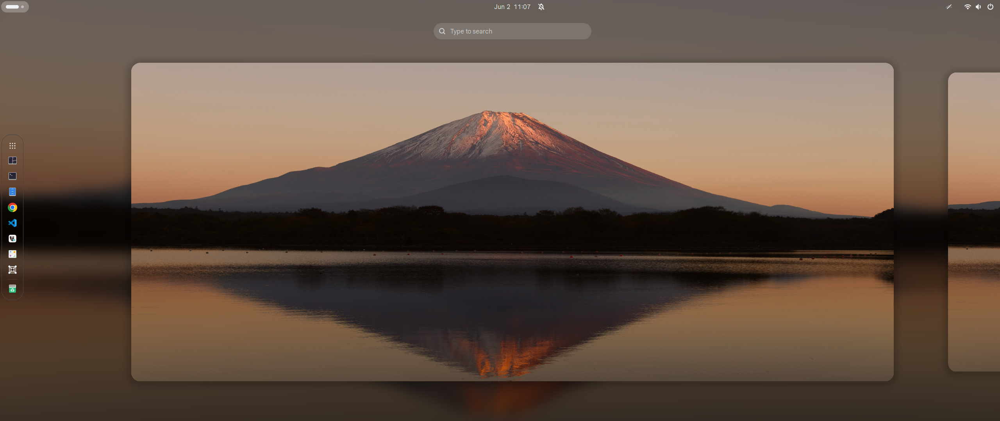
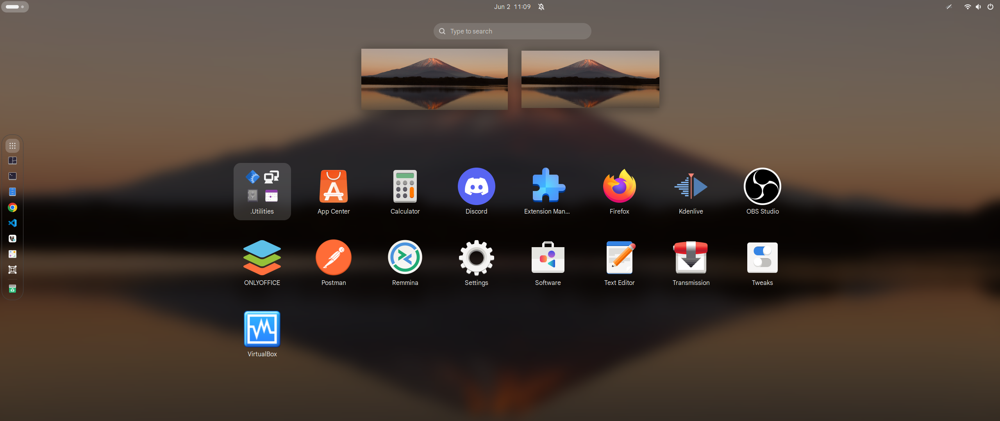
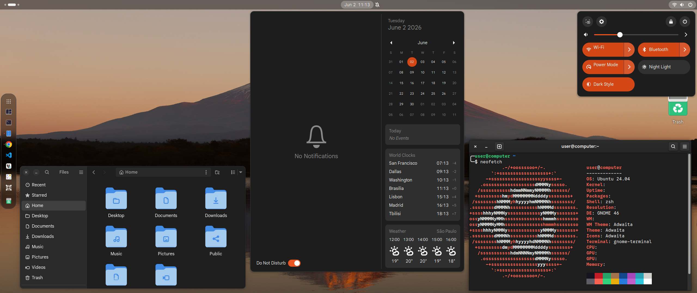
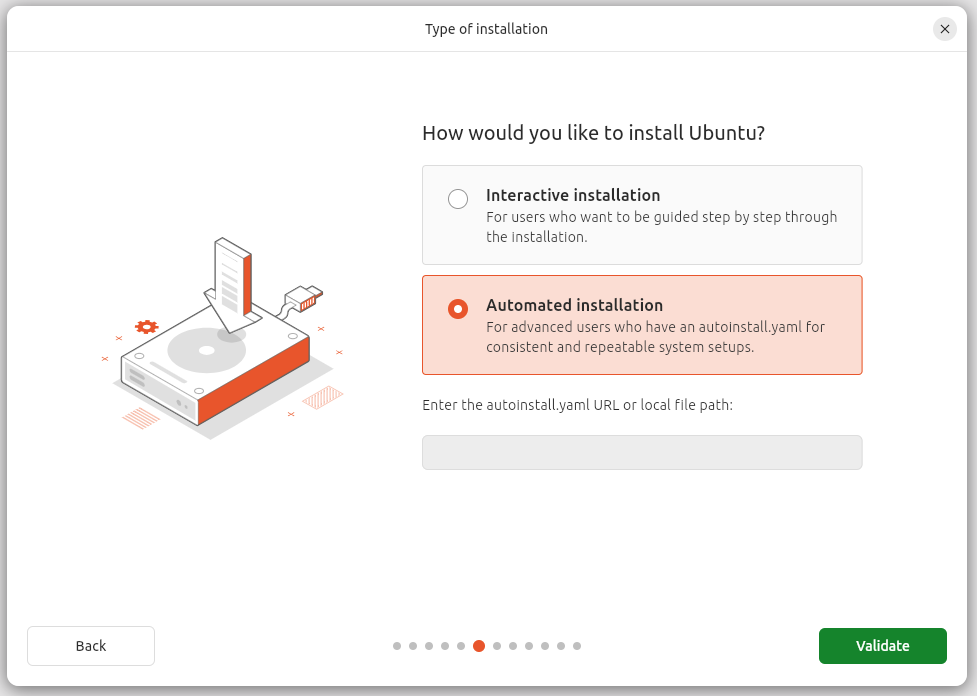

<div align="center">
  <h1>GNOME + Environment Setup</h1>
  <a href="https://github.com/lucasoal/my_gnome_setup/archive/refs/heads/main.zip">📁 • Download ZIP</a>
  <br> <br>
</div>

The script automates the installation and configuration of a full development workstation</i>

  <br>
  <br>


## 📦 Packages / Softwares

> [!IMPORTANT]
> Use [autoinstall.yaml](autoinstall.yaml) during the instalation.
>
>  <br>

- **APT**
  - `build-essential` | `curl` | `flameshot` | `git` | `gnome-clocks` | `gnome-shell-extension-manager` | `gnome-tweaks` | `gnome-weather` | `htop` | `jq` | `make` | `nodejs` | `python3-pip` | `python3-venv` | `remmina` | `software-properties-common` | `tar` | `tree` | `unzip` | `vim` | `wget` | `zip` | `zsh`
- **Snap**
  - `brave` | `dbeaver-ce` | `discord` | `postman` | `pyenv` 
- **DEB**
  - `Google Chrome` | `VS Code`
- **PPA Deadsnakes**
  - Python `3.10` | `3.12` | `3.14`
- **VPN**
  - Cloudflare WARP (1.1.1.1)

### 🗑️ Remove

- Games and related packages (`gnome-games`, `sauerbraten`, `supertux`, `steam`...)

## 🐚 Shell

> [!IMPORTANT]
> Use [install](./install) after install the OS.

- **Terminal**
  - Oh My ZSH
    - Theme · "bira"
- **Fonts**
  - Interface · Helvetica 12
  - Documents · Helvetica 11
  - Monospace · Monospace 12
- **Background**
  - Catalina 

## ⌨️ Keyboard Shortcuts

- **Flameshot PrtSc**
  - `flameshot gui`
  - `Super` + `PrtSc`
- **Home Folder**
  - `nautilus $HOME`
  - `Super` + `E`
- **Cloudflare VPN On**
  - `warp-cli connect`
  - `Ctrl` + `Alt` + `V`
- **Cloudflare VPN Off**
  - `warp-cli disconnect`
  - `Ctrl` + `Alt` + `Shift` + `V`

## ⚜️ Install

```sh
chmod +x install && sudo ./install
```